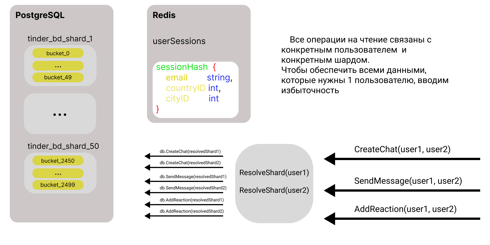

# TinderSystemDesign
Проектирование системного дизайна аналога продукта Tinder, который выдерживает высокие нагрузки и может масштабироваться

## 1. Тема и целевая аудитория

Tinder — популярное приложение, предназначенное для романтических знакомств в соответствии с заданными параметрами и с учётом геолокации. Управляется североамериканской корпорацией Match Group (англ.)рус., дочерней компанией IAC.

### Целевая аудитория
#### Статистика пользователей Tinder по странам в 2023 году

С более чем **75 миллионами активных пользователей** в месяц, Tinder является самым популярным приложением для знакомств в мире. Приложение доступно в **197 странах**, и наибольшая доля подписок приходится на США.

#### Топ стран по количеству пользователей

##### Соединенные Штаты

- **Пользователей**: 7,8 миллиона

##### Великобритания

- **Пользователей**: 5 миллионов

##### Другие страны с высоким числом пользователей

- Бразилия
- Испания
- Франция
- Мексика
- Аргентина
- Германия
- Австралия
- Бельгия
- Италия
- Индия
- Чили
- Финляндия
- Дания
- Норвегия
- Новая Зеландия
- Нидерланды

---

> *Данные основаны на статистике Tinder на 2023 год. [Источник](https://worldpopulationreview.com/country-rankings/tinder-users-by-country)*

### Требования к функционалу

#### Ключевой функционал [MVP]

Основная цель Tinder — это помогать людям знакомиться. Следовательно, ключевой функционал должен обеспечивать:

1. **Создание профиля**: Возможность для пользователя создать профиль, загрузить фотографии и написать краткую информацию о себе.
2. **Лента "свайпов"**: Лента профилей на основе алгоритмов рекомендаций для свайпов.
3. **Матчинг**: Автоматическое соединение двух пользователей при взаимных "лайках".
4. **Чат**: Возможность отправки и получения текстовых сообщений между совпавшими пользователями.

---

## 2. Расчет нагрузки

### Продуктовые метрики
- Месячная аудитория [MAU]– 75 миллионов уникальных пользователей [[Источник](https://journal.co.com/2023/05/17/tinder-statistics-2023-analyzing-user-demographics-and-behavior/)]
- Дневная аудитория [DAU] – примерно 11 миллионов уникальных пользователей [[упоминается, что в день более 10 млн. пользователей](https://www.bailiwickexpress.com/jsy/life/technology/one-million-people-have-now-paid-tinder-plus/), [1.6 млрд. свайпов в день](https://journal.co.com/2023/05/17/tinder-statistics-2023-analyzing-user-demographics-and-behavior/), [при лимите в 100 свайпов в день для пользователей без подписки](https://celebrity.fm/ru/does-tinder-have-limited-likes/), [более 6,03 миллиона платных подписчиков](https://hookupdate.net/tinder-statistics/)]
- Общий RPS – 23 тыс. [в день регистрируется 2 млрд. запросов [[Источник]](https://datingzest.com/tinder-statistics/)]
- Среднее количество действий пользователя по типам в день:


| **Тип действия** | **Количество действий в день**         | **RPS** |
|------------------|----------------------------------------|---------|
 | **Все действия** | 2 млрд.                                | 23k     |
 | **Свайпы**       | 1,6 млрд.                              | 18.5k   |
 | **Регистрации**  | 100 тысяч                              | 0.0012k |
 | **Сообщения**    | 100 млн. (по 3.3 сообщения на 1 match) | 1.16k   |
 | **Метчи**        | 30 млн.                                | 0.35k   |


### Технические метрики

1. Размер хранимых данных по типам[ТБ]:

- Фото пользователей: в среднем ~5 фото на пользователя по 2МБ – 953 ТБ
- Данные пользователей: 0.1 МБ на пользователя – 9.5 ТБ
- Чаты активных пользователей: 1 МБ текста на 65 Млн. активных пользователей – 62 ТБ
2. Сетевой трафик:

- 1.6 млрд. свайпов, грузится минимум 1 фотография ~2МБ – 3000ТБ / сутки
- 30 млн. метчей – просмотры профиля ~10МБ – 286ТБ / сутки
3. Пиковая нагрузка

Сочтем, что в пиковые часы количество запросов в секунду удваивается (x2):
- 5.5 млн. во время пиков:
- - свайпы – 8 * 2 * (3000ТБ / (24 * 60 * 60)) = 544 Гбит/сек 
- - метчи - 8 * 2 * (286 ТБ / (24 * 60 * 60)) = 54.24 Гбит/сек

## 3. Глобальная балансировка нагрузки

### Расположение дата-центров:
  
  Tinder – приложение, которым пользуются по всему миру. Большинство пользователей находится в США и Британии.
  Необходимо обеспечить хорошую связь как минимум в этих регионах. Поэтому в качестве расположения дата-центров выбирает следующие города:
  - Нью-Йорк
  - Сан-Франциско
  - Сиэтл
  - Даллас
  - Лондон
  
  В Южной Америке находятся страны, которые входят в топ по количеству пользователей, поэтому добавим ЦОДы и там:
  - Сан-Паулу
  - Буэнос-Айрос
  
  На Европу также приходится большое количество пользователей, и они распределены равномерно, соответственно нужно, чтобы были ЦОДы и там:
  - Цюрих
  - Франкфурт
  - Стокгольм
  - Париж
  - Мадрид

  Эти дата-центры обеспечат хорошим пингом регионы Северной и Южной Америки и Европы
  
  Индия тоже входит в топ по количеству пользователей. Будет хорошим решением расположить ЦОДы в следующих городах:
 - Нью-Дели
 - Мумбаи
  
  Эти дата-центры обеспечат доступность в Азии. 
  Так как в Африке нет большого количества пользователей, то этому региону будет достаточно расположить 1 дата-центр в городе Йоханнесбург, тк он находится на Юге Африке, для которой Европейские сервера будут отвечать дольше, чем для Северной.

  Эти города обеспечат хороший пинг во всех регионах мира. 


  

### Принцип глобальной балансировки:
#### GeoDNS
Для выбора конкретного ЦОДа хорошим решением будет использование принципа балансировки GeoDNS, так как пользователи сервиса есть во всем мире, а нам нужно, чтобы запросы пользователя обрабатывал ближайший к нему дата-центр.
Как это работает. Днс сервер хранит данные о провайдерах, их IP-адресах и о том, где они расположены. Обладая этой информацией DNS сервер возвращает IP-адрес ближайшего дата-центра первым в списке.


## 4. Локальная балансировка нагрузки
### Путь клиента до сервера
После определения IP-адреса дата-центра, запрос приходит на виртуальный IP-адрес, который балансирует запросы на физические сервера.
Используется L3 балансировка Virtual Server via Direct Routing, в котором подменяется Mac-адрес места назначения запроса.
Физические сервера представляют собой Nginx сервера с модулем Nginx Upstream module. Nginx является Upstream Proxy для сервера, на котором работает бизнес логика.

### **L7**
#### Nginx
Для балансировки нагрузки на уровне **L7** используем **Nginx Upstream**. 
Принцип балансировки – взвешенный Round Robin. 
Nginx хорошо подходит для этого.
Websocket соединения тоже будут работать, а для передачи сообщений между разными экземплярами приложений можно использовать кластер Redis с его Streams, чтобы все приложения могли обработать сообщение. Но это уже касается темы хранения данных, а не балансировки.
#### Service Mesh
Также на уровне L7 используем технологию Service Mesh. Это поможет не только балансировать нагрузку, но и поможет тестировать новые версии приложения до выкатки. Каждый экземпляр Service Mesh соответствует одному сервису. На верхнем уровне у него стоит Nginx, который обеспечивает отказоустойчивость при запросах к своему микросервису.
Service Mesh обеспечивает балансировку нагрузки с помощью обращения к наименее нагруженным нодам Kubernetes. Это обеспечивается с помощью метрик, например CPU Usage за последние 500ms. 
Через http-хэдеры можно задать конкретную версию сервиса и обратиться к нему. 
Эти хэдеры могут быть также использованы для тестирования путем изменения текущей даты, включения себя в список какого-либо из AB-тестов и т.д.
Service Mesh кладет в Service Discovery информацию о том, за какой сервис он отвечает и как к нему(или к его экземпляру, если его реплицировать внутри nginx) можно обратиться.
Другие микросервисы общаются между собой также через Service Mesh.
Mesh также должен уметь фильтровать заголовки, чтобы любые пользователи не могли воспользоваться, чтобы обратиться к какой-либо конкретной версии микросервиса или подменить через заголовки какие-либо еще данные.
Может быть белый список таких хэдеров, а остальные заголовки должны фильтроваться с помощью заголовки, например X-Serice-Mesh-Access-Token.
Этот сервис также можно реплицировать и на уровне Nginx, но это не имеет большого смысла в плане балансировки, так как репликации все равно обращаются к одному и тому же кластеру Kubernetes, также известно, что при старте приложения инициализирую подключения к другим Service Mesh сразу и переиспользуют это подключение.
Но это может быть полезно для отказоустойчивости, также код можно написать так, чтобы при потере соединения к какому-либо микросервису (его Service Mesh) можно было обратиться к Service Discovery и получить живой Mesh.
Хорошим инструментом в связке с Kubernetes будет **Ingress**

Mesh не хранит в себе никакие данные, поэтому может быть реплицирован неограниченное количество раз. Э
то увеличивает только нагрузку на Service Discovery.
#### Service Discovery
Service Discovery хранит данные, которые кладет в него Service Mesh. 
В схеме обращение микросервисов друг к другу обозначено пунктирными линиями. Это означает, что сервисы обращаются друг к другу не напрямую, то есть не через захардкоженные ip-адреса или доменные имена.
Данные для подключения к микросервису(Service Mesh) как раз и выдает Service Discovery.
Если для 1 сервиса зарегистрировано несколько Mesh-ей, то Discovery должен балансировать в своих ответах между этими данными. Самый простой способ Round Robin взвешенный или нет.
Также если Mesh имеет метрику нагруженности, то можно использовать её, что обеспечить равномерность распределения нагрузки.
Service Discovery должен уметь поддерживать актуальность своих данных. 
Это обеспечивается тем, что каждый Mesh, который передает ему данные, должен сообщать способ, как образом можно проверить его живость, или же делать это одним стандартным методом, например через endpoint "/healthcheck".
Это актуально не только для Mesh-ей, которые обмениваются данными между собой, но и для Composer.
Для реализации Service Discovery используем самописное ПО с использованием ETCD.

Discovery хранит в себе данные о сервисах, поэтому не может быть реплицирован без накладных расходов. Поэтому здесь можно выбрать Master-Slave репликацию с поддержкой состояния слейва. Это обеспечит Discovery отказоустойчивость.
Также есть вариант использовать несколько образцов сервиса, а данные хранить в централизованном кеше, например в кластере Redis. У этого подхода есть минус. Выдавать данные из кеша медленней, чем отправлять те же данные из оперативной памяти, так как для получения данных из кеша тоже нужны сетевые запросы.
Этот минус тоже можно покрыть тем, чтобы данные все же лежали в оперативной памяти каждого образца, но обновлялись через подписку на Stream в Redis.
##### Как отправлять запросы Service Discovery
Во внутренней сети бэка должно быть определенное доменное имя, по которому резолвится хост Discovery.
Во всех nginx конфигах должно быть отключено кеширование DNS запросов, чтобы в любой нужный момент в DNS сервере можно было поменять ip-адрес этого доменного имени.
В случае dns балансировки появляется возможность несколько образцов Discovery уже на уровне Nginx.
#### Composer
Composer – главный объект бэкенда приложения. Это очень сложное и конечное api приложения, к которому обращается Frontend приложения.
Все необходимые данные он получает от других объектов архитектуры.
Главная его суть заключается в том, чтобы собрать все необходимые данные вместе и вернуть ответ клиенту. 
Поэтому он и называется Composer, ведь он собирает композицию из запросов ко всевозможным сервисам и выдает ответ клиенту в том виде, который ему нужен. Это скорее всего RestAPI.
У Composer нет состояния. Поэтому образцы этого приложения могут быть созданы в любом количестве для возможности выдержать нужный RPS. 

### Kubernetes
Кубернетес позволяет оркестрировать сервис, проводить постепенный деплой, повышает отказоустойчивость.

### **L4**
Для балансировки нагрузки на уровне L4 используем технологию Virtual Server via Direct Routing.
Все запросы клиента должны пройти путь через сетевое оборудование и дойти до виртуального IP-адреса.
Все запросы с виртуальных IP-адреса будет передаваться на конкретный сервер Composer.

#### Дополнительно
Конечно, нужно отметить, что должны быть обеспечена функциональная балансировка во внутренней сети по субдоменам и префиксам.
Все, что можно закешировать, должно быть закешировано.
Должен быть реализован rateLimiter на уровне балансировщиков(frontend посылает запросы с ключом клиента).
Должна быть защита от DDos атак и ботов, например Cloudflare.

### SSL терминация
Терминация SSL происходит на уровне Nginx Composer-а.
Для оптимизации этого процесса используется session cache, session tickets.


### Схема распределения нагрузки и отказоустойчивости
Пояснения к балансировке, отказоустойчивости и безопасности описаны в предыдущих пунктах. 


## 5.  Логическая схема базы данных

### Таблицы

#### Сервис авторизации, данные о пользователях.

##### Таблица users
Для возможности обеспечения шардирования зададим первичным ключем почту пользователя, которая должна быть уникальной. 
По ней в последующем будет считаться хеш для определения бакета/шарда.
Foreign key связи не используются, тк они могут храниться на другом физическом объекте базы данных.
Все ограничения, кроме UNIQUE и NOT NULL, проверяются и валидируются на уровне бизнес-логики.
Получаем следующую таблицу:

**users**

| **Поле**       | email            | password_hash |
|----------------|------------------|---------------|
| **Тип**        | text             | text          |
| **Constraint** | UNIQUE, NOT NULL | NOT NULL      |


Максимальная длина почты – 320 символа – 320 байт. 
Максимальная длина хеша пароля – 16 байт.
На одного пользователя **336 байт**.

В основном нагрузка на чтение. Используется только при регистрации и авторизации.

##### Таблица user_info

**user_info**

| **Поле**       | email_hash       | name     | age      | city_id  | country_id | sex            | description  |
|----------------|------------------|----------|----------|----------|------------|----------------|--------------|
| **Тип**        | text             | text     | number   | number   | number     | ENUM('M', 'F') | text         |
| **Constraint** | UNIQUE, NOT NULL | NOT NULL | NOT NULL | NOT NULL | NOT NULL   | NOT NULL       | DEFAULT NULL |

email_hash - 16 byte.
name - 16 byte.
sex - 1 byte.
description - 512 byte.
age - 1 byte.
city_id - 2 byte.
country_id - 1 byte.

На одного пользователя **512 байт**.

В основном нагрузка на чтение. Часто запрашивается для отображения данных о пользователе.

##### Таблица user_photo

**user_photo**

| **Поле**       | email_hash | file_hash | is_main  | order    |
|----------------|------------|-----------|----------|----------|
| **Тип**        | text       | text      | bool     | number   |
| **Constraint** | NOT NULL   | NOT NULL  | NOT NULL | NOT NULL |

email_hash - 16 byte.
file_hash - 16 byte.
is_main - 1 byte.
order - 1 byte.

Всего **34 байт**.

В основном нагрузка на чтение. Часто запрашивается для отображения фотографий пользователя.

##### Таблица user_filters

**user_filters**

| **Поле**       | email_hash | min_age  | max_age  | sex_filter          |
|----------------|------------|----------|----------|---------------------|
| **Тип**        | text       | number   | number   | ENUM('M', 'F', 'A') |
| **Constraint** | NOT NULL   | NOT NULL | NOT NULL | NOT NULL            |

email_hash - 16 byte.
min_age - 1 byte.
max_age - 1 byte.
sex_filter - 1 byte.

Чаще используется для формирования ленты на чтение.

Всего **19 байт**.

### Остальные данные. 
Данные о сессиях пользователей будут храниться в кеше, который должен копировать данные на диск.
Сессия представляет собой хеш сессии, которая должна храниться у клиента, и email пользователя.
1 сессия требует 336 байт – с копированием данных на диск **672 байт**.

#### Сервис свайпов.

##### Таблица reactions

**reactions**

| **Поле**       | email_hash_from | email_hash_to | reaction       |
|----------------|-----------------|---------------|----------------|
| **Тип**        | text            | text          | ENUM('L', 'D') | 
| **Constraint** | NOT NULL        | NOT NULL      | NOT NULL       |

email_hash_from - 16 byte.
email_hash_to – 16 byte.
reaction - 1 byte.

Всего **33 байт**.

Чаще всего используется на запись.

##### Таблица matches

**matches**

| **Поле**       | email_hash_from | email_hash_to | shown         |
|----------------|-----------------|---------------|---------------|
| **Тип**        | text            | text          | bool          | 
| **Constraint** | NOT NULL        | NOT NULL      | DEFAULT FALSE |

email_hash_from - 16 byte.
email_hash_to – 16 byte.
shown - 1 byte.

Всего **33 байт**.

Как запись, так и чтение происходят часто.

##### Таблица show_history

**show_history**

| **Поле**       | email_hash_from | email_hash_to | show_date |
|----------------|-----------------|---------------|-----------|
| **Тип**        | text            | text          | date      | 
| **Constraint** | NOT NULL        | NOT NULL      | NOT NULL  |

email_hash_from - 16 byte.
email_hash_to – 16 byte.
show_date - 4 byte.

Всего **36 байт**.
Эта таблица нужна для составления ленты пользователей. Часто используется для записи, старые данные стираются. 

##### Таблица feed

**feed**


| **Поле**       | email_hash   | users_to_show   |
|----------------|--------------|-----------------|
| **Тип**        | text         | ARRAY[]::text[] | 
| **Constraint** | NOT NULL     | NOT NULL        |

email_hash_from - 16 byte.
users_to_show – 16 * 50 byte.

Всего **816 байт**.
Алгоритмы заранее подготавливают ленту для пользователя, периодически её обновляя и сверяясь с таблицей show_history.
Данные могут быть закешированы кешем, который должен валидироваться алгоритмом, подготавливающим подготавливает ленту.

Используется как для чтения, так и для записи равномерно.

#### Сервис сообщений.

##### Таблица chats

**chats**

| **Поле**       | chat_id  |
|----------------|----------|
| **Тип**        | text     | 
| **Constraint** | NOT NULL |

chat_id - **16 byte**.

Используется при создании чата.

##### Таблица chat_users

**chat_users**

| **Поле**       | chat_id  | email_hash |
|----------------|----------|------------|
| **Тип**        | text     | text       | 
| **Constraint** | NOT NULL | NOT NULL   |

chat_id - 16 byte.
email_hash - 16 byte.

Используется при создании чата и получении списка чатов.

Всего **32 byte**.

##### Таблица messages

**messages**

| **Поле**       | chat_id  | sender_hash | content  | sent_at   | read_status   |
|----------------|----------|-------------|----------|-----------|---------------|
| **Тип**        | text     | text        | text     | timestamp | bool          | 
| **Constraint** | NOT NULL | NOT NULL    | NOT NULL | NOT NULL  | DEFAULT FALSE |

chat_id - 16 byte.  
sender_hash - 16 byte. 
content - 256 byte.
sent_at - 8 byte.
read_status - 1 byte.

Всего **297 byte**.

Используется равномерно как для чтения, так и для записи.

#### Сервис медиафайлов.

Сами файлы должны храниться на серверах, с которыми можно работать по удобному протоколу, например S3.
Данные о принадлежности файлов конкретным пользователям хранятся в базе данных.

##### Таблица files

files

| **Поле**       | file_hash | file_info | file_size | allowed_users   |
|----------------|-----------|-----------|-----------|-----------------|
| **Тип**        | text      | text      | number    | ARRAY[]::text[] | 
| **Constraint** | NOT NULL  | NOT NULL  | NOT NULL  | NOT NULL        |

file_hash – 16 byte.
file_info – 64 byte.
file_size – 8 byte.
allowed_users – 16 * ~10 byte.

Чаще всего производятся операции на чтение.

Всего **248 byte**.

### Бизнес логика, работающая с базами данных. Обеспечение реализации API.

#### Регистрация и последующее изменение профиля пользователя.

Для работы с профилем пользователя используются следующие базы: 

- users
- user_info
- user_photo
- user_filters
- files

Таблица users используется только при регистрации и авторизации
При регистрации и обновлении профиля могут использоваться все остальные таблицы:
1) user_info - загружается профиль пользователя, информация о нем.
2) user_photo, files – сначала фотографии пользователя загружаются в сервис медиафайлов и отмечаются в таблице files, файлу выдается его хеш. Хеш файла добавляется в таблицу user_photo.
3) user_filters – загружается информация о предпочтениях пользователя. Эта информация нужна для формирования ленты.

#### Формирование ленты и метчи.

Для работы с лентой и метчами нужны следующие таблицы:

- user_info - для отображения описания пользователя
- user_photo – для выбора файлов фотографий пользователя
- user_filters - для формирования ленты с учетом предпочтений
- files – для возможности выдачи конкретных фотографий
- reactions - для сохранения свайпов пользователей. Должна периодически очищаться от устаревших свайпов.
- matches - для сохранения совпадений
- show_history - для формирования более релевантной ленты
- feed - для возможности быстрее выдавать ленту без сложных запросов

#### Общение образовавшихся пар

Для обеспечения возможности сохранять чаты и сообщения используются следующие таблицы:
- chat_users
- chats
- messages

### Размер данных:
1 КБ ≈ 1e3

1 МБ ≈ 1e6

1 ГБ ≈ 1e9

---
1 КБ = 1e3 * x

1 МБ = 1e6 * x^2

1 ГБ = 1e9 * x^3

1 ТБ = 1e12 * x^4

---
x   = 2^10 / 1e3 = 1024 / 1000 = 1.024

x^2 = 1.048 576

x^3 = 1.073 741 824

x^4 = 1.099 511 628

75 млн. пользователей * (336 + 512 + 19 + (34 + 248) * ~5) ~= (75ГБ / 1.048576) * ~2.314 <= 165.5 ГБ
1.6 млрд. свайпов * (33 + 36) byte * 365 дней = (1.6 ТБ/1.099 511 628) * 25.185  = 36.65 ТБ
30 млн. метчей * 33 * 365 дней = (30ГБ / 1.048576) * 12.045 = 344.6 ГБ
100 млн. сообщений * 297 byte * 365 дней = 10.8405 ТБ/ 1.099 511 628  = 9.86 ТБ

36.65

Итого на обеспечение функционирования баз данных необходимо минимум **47 ТБ**  
На хранение фотографий пользователей: 75 млн * 2 МБ = 143.05 ТБ

| Операция     | Расчет                           | Результат     | Запись | Чтение |
|--------------|----------------------------------|---------------|--------|--------|
| Пользователи | 75 млн. * ~2314 byte             | <= 165.5 ГБ   | 1k     | 20k    |
| Свайпы       | 1.6 млрд. * 365 * (33 + 36) byte | 36.65 ТБ      | 18.5k  | 9.25k  |
| Метчи        | 30 млн. * 33 byte * 365          | 344.6 ГБ      | 0.35k  | 0.35   |
| Сообщения    | 100 млн. * 297 byte * 365        | 9.86 ТБ       | 1.16k  | 2.32k  |
| Фотографии   | 75 млн * 2МБ                     | 143.05 ТБ     | 1k     | 20k    |
| **Итого**    |                                  | **190.05 TB** |        |        |



## 6.  Физическая схема базы данных

### Выбор СУБД

Для реализации нашего API будет достаточно использование PostgreSQL.
Схемы таблиц и их связи описаны в пункте №5.

Для хранения сессий выбираем Redis
ключ – sessionHash
хранимые значения:
```.js
sessionHash: {
  email string,
  countryID int,
  cityID int
}
```
память на 1 сессию: 338 байт
при выгрузке данных на диск в два раза больше: 676 байт.
10 млн. активных пользователей => 6.6 ГБ на хранение сессий.

### Индексы
#### Данные о пользователе
**users**: INDEX HASH(email)

**user_info**: INDEX HASH(email_hash)

**user_photo**: INDEX HASH(email_hash)

**user_filters**: INDEX HASH(email_hash)

Для быстрого получения данных о пользователе и получения ленты, нужны индексы по всем первичным ключам этих таблиц.

#### Свайпы и реакции
**reactions**:
Два хеш-индекса для каждого поля.
Одно нужно для быстрой проверки при ответной реакции, а другое для получения лайкнувших пользователей.

**matches**:
Два хеш-индекса для каждого поля.
Для получения пользователем своих метчей.

**show_history**:
Один хеш-индекс для поля **email_hash_from**, чтобы быстро находить, кого уже видел пользователь при формировании ленты.

**feed**:
Один хеш-индекс для поля **text**, чтобы быстро находить свою ленту пользователей

#### Чаты

**chats**:
Индексы не нужны
**chat_users**:
хеш-индекс по полю **email_hash** для получения пользователем своих чатов.

**messages**:
BTree индекс по **sent_at**
Хеш-индекс **chat_id**

#### Информация о файлах
**files**:
хеш-индекс по полю **file_hash** для быстрого пойска фотографий

### Репликация и шардирование:

#### Принцип репликации

Функция резолва конкретного сервера с БД для записи и чтения:

```.go
func Resolve(countryID, cityID int) (*dbConn, error)
```

Так как пользователи одного региона все пишут в одну базу данных, их данные будут являться первичными.
Их данные будут реплицироваться в остальные дата-центры. Так для каждого сервера БД.
Получается, что каждый сервер является первичным для данных своего региона, но также копирует и все остальные.

Данные countryID и cityID берутся из сессии пользователя.

#### Шардирование

На начальном этапе у нас 16 дата-центров – 16 физических серверов.
Создание фиксированного количества шардов ограничивает дальнейшее масштабирование, поэтому создаем 50 бакетов на каждом физическом сервере для виртуального шардирования.

Ключем будет `email_hash` – уникальный идентификатор каждого пользователя, вычисляемый на основе его email.

### Схема резервного копирования и балансировка

В качестве горячей резервной копии создаем 1 реплику базы данных в каждом дата-центре, который зависит от другого провайдера.
Если мастер падает, то эта реплика становится новым мастером, отвечающим за данные пользователей региона, в котором находится дата-центр.


Холодная резервная копия просто периодически выгружается на диск.
Тут должен быть простой или сложный алгоритм, который мержит снимки со всех серверов БД. Алгоритм следующий:
Мы знаем, какая база данных отвечает за конкретный регион(`countryID`, `cityID`), поэтому мы знаем, за какие данные отвечает эта база данных, как источник правды, потому что все таблицы связаны с пользователем, а у пользователя определены данные по стране и городу.

У таблиц должен быть приоритет в резервировании. Самые важные таблицы – сообщения и метчи.

### Объем данных с учетом репликации и количества дата-центров:
В П.4 мы выяснили, сколько бы весили данные, если бы они хранились в 1 базе данных:
**47 ТБ**
В 16 датацентрах с 1 репликой + 1 резервной копией будет 16 * 3 = 48 
47ТБ * 48 = 2.2 ПБ


## 7.  Алгоритмы

### Алгоритм формирования рекомендаций для ленты пользователя

Алгоритм используется для заполнения ленты пользователя новыми рекомендациями на основе фильтров, истории показов и совпадений. Приоритет отдаётся пользователям, чьи ленты содержат наименьшее количество рекомендаций.

#### Шаги алгоритма

##### Шаг 1: Определение границ рекомендаций
- Определите `MIN_FEED_COUNT` — минимальное количество рекомендаций в ленте пользователя, при котором будет происходить заполнение.

##### Шаг 2: Проверка текущего состояния ленты
- Для каждого пользователя (A) проверьте количество оставшихся рекомендаций в ленте.
- Если количество меньше `MIN_FEED_COUNT`, переходите к следующему шагу.

##### Шаг 3: Исключение уже показанных и матчей
- Получите из `show_history` и `matches` записи для пользователя (A), чтобы исключить этих пользователей из будущих рекомендаций.

##### Шаг 4: Применение фильтров пользователя
- Используйте данные из `user_filters` для фильтрации кандидатов по возрасту (`min_age`, `max_age`) и полу (`sex_filter`).

##### Шаг 5: Поиск подходящих кандидатов
- Найдите пользователей (B), которые соответствуют фильтрам пользователя (A) и не входят в список исключений с Шага 3.

##### Шаг 6: Ранжирование по сходству информации
- Рассчитайте "коэффициент сходства" между пользователем (A) и каждым потенциальным кандидатом (B) на основе информации из `user_info`.

##### Шаг 7: Сортировка кандидатов
- Отсортируйте кандидатов (B) по убыванию коэффициента сходства.

##### Шаг 8: Формирование рекомендаций
- Выберите топ-N кандидатов для добавления в ленту пользователя (A), где N достаточно для достижения `MIN_FEED_COUNT`.

##### Шаг 9: Запись рекомендаций в ленту
- Добавьте выбранных кандидатов в таблицу `feed` для пользователя (A), исключая повторения.

##### Шаг 10: Логирование показов
- Для каждого добавленного в ленту пользователя (B) добавьте запись в `show_history` о показе пользователю (A).##

### Алгоритм слияния резервных копий БД с разных серверов

Для реализации алгоритм слияния резервных копий с разных серверов PostgreSQL
в единую резервную копию с учётом логики распределения данных по параметрам countryID и cityID можно использовать следующую стратегию:

1. **Определение логики слияния**: Необходимо точно определить правила слияния для каждой таблицы. Например, если записи в таблицах уникальны и не пересекаются по серверам, то слияние может быть прямым без проверки на дубликаты. Если же записи могут пересекаться, нужно определить механизм разрешения конфликтов.
2. **Механизм разрешения конфликтов**: При возникновении конфликтов нужно выбирать те записи, которые соотносятся с его главным сервером.
Так как все записи происходят от какого-либо пользователя, то все записи в таблицы можно идентифицировать и в каждой резервной копии копировать только те записи, за которые отвечать эта копия.
3. **Выбор инструментария**: Для резервного копирования можно использовать встроенные инструменты PostgreSQL, такие, как pg_dump для создания копий и pg_restore для восстановления данных, а также расширения типа pgBackRest, Barman или WAL-E для работы с WAL-логами и инкрементным бэкапом.
4. **Автоматизация процесса**: Написание скриптов для автоматического создания резервных копий с каждого сервера. Это могут быть Python-скрипты с использованием библиотеки psycopg2 или другие инструменты автоматизации.
5. **Синхронизация и слияние**: Использование инструментов синхронизации данных для слияния резервных копий в одну. Такие инструменты могут сравнивать данные и объединять их с учётом логики распределения данных. Можно использовать rsync, pg_dump --append, или специализированные инструменты для работы с PostgreSQL.
6. **Централизованное хранилище**: Организация централизованного хранилища для совмещённой резервной копии, которое может быть реализовано через облачное хранилище или санкционированный сервер хранения данных.
7. **Тестирование и валидация**: Перед тем как запускать такую систему в продакшен, необходимо тщательно протестировать процесс слияния на предмет сохранения целостности данных и отсутствия потерь информации.
8. **Мониторинг и логирование**: Настройка мониторинга процесса слияния, чтобы в случае ошибок можно было быстро реагировать и восстанавливать процесс.
---
#### При создании такой системы важно учитывать следующие аспекты:
1. **Производительность**: Процессы резервного копирования и слияния могут быть ресурсоёмкими, поэтому следует планировать их запуск во время наименьшей нагрузки на систему.
2. **Безопасность**: Необходимо обеспечить безопасность данных на всех этапах, используя шифрование и безопасные каналы передачи данных.
3. **Соответствие**: Система должна соответствовать всем требованиям к хранению и обработке данных, включая GDPR и другие регуляторные стандарты.

## 8.  Технологии

### Таблица используемых технологий

| Технология           | Применение                                                                  | Обоснование                                                           |
|----------------------|-----------------------------------------------------------------------------|-----------------------------------------------------------------------|
| Golang               | Реализация Backend                                                          | Надежный и просто язык для реализации Web-приложений                  |
| Pproff               | Профилирование go-приложения                                                | Повышение надежности кода                                             |
| Python               | Написание скриптов создания резервных копий и разрешения конфликтов слияния | Библиотека psycopg2                                                   |
| Lua                  | Скрипты для Nginx                                                           | Скрипты пишутся только на этом языке                                  |
| PostgreSQL           | Хранение данных                                                             | Лидер в OpenSource                                                    |
| Redis                | Хранение сессий и `каналы` уведомлений                                      | Понятный и простой инструменты                                        |
| Kafka                | Для реализации регистрации и восстановления пароля                          | Масштабируемое и отказоустойчивое решение                             |
| S3 хранилище         | Хранение фотографий пользователей                                           | Распределенное хранение файлов                                        |
| Prometheus           | Хранение метрик                                                             | Распространенный язык для создания метрик                             |
| Graylog              | Хранение логов                                                              | Распределенный сбор метрик                                            |
| Jaeger OpenTelemetry | Трейсинг                                                                    | Легкая интеграция с кодом на Go                                       |
| Grafana              | Отображение графиков                                                        | Легкая интеграция с Prometheus                                        |
| Kubernetes           | Деплой, балансировка                                                        | Масштабируемость, отказоустойчивость                                  |
| Gitlab               | Хранение кода и CI/CD                                                       | Возможность поднять свой сервер GitLab, конкуренты: GitHub            |
| Confluence, Jira     | Ведение документации и планирование разработки                              | Удобный инструментарий для ведения документации и интеграция с GitLab |
| View JS/TS           | Frontend приложения                                                         | Фреймворк, в котором собрано все для реализации приложения            |
| Vault                | Хранение секретов production, stg                                           | Хорошая реализация ACL                                                |
| ETCD                 | Реализация Service Discovery                                                | Распределенное хранение значений                                      |
| Ingress              | Балансировка Kubernetes, реализация Service Mesh                            | Хорошая связка с Kubernetes                                           |
| Nginx                | L7 балансировка                                                             | Простая настройка, высокая производительность                         |

## 9.  Обеспечение надежности

## 10.  Схема проекта

## 11.  Расчет ресурсов


