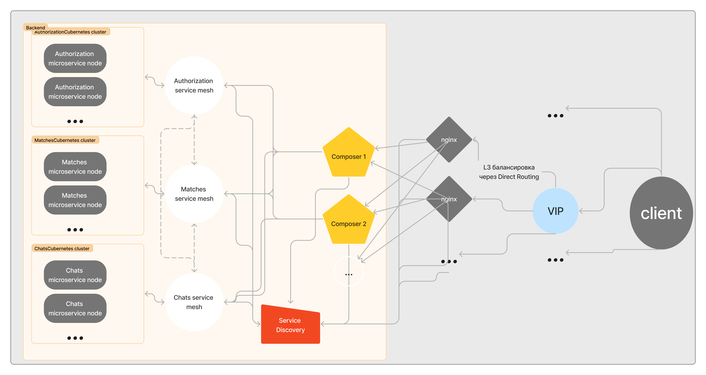

# TinderSystemDesign
Проектирование системного дизайна аналога продукта Tinder, который выдерживает высокие нагрузки и может масштабироваться

## 1. Тема и целевая аудитория

Tinder — популярное приложение, предназначенное для романтических знакомств в соответствии с заданными параметрами и с учётом геолокации. Управляется североамериканской корпорацией Match Group  (англ.)рус., дочерней компанией IAC.

### Целевая аудитория
#### Статистика пользователей Tinder по странам в 2023 году

С более чем **75 миллионами активных пользователей** в месяц, Tinder является самым популярным приложением для знакомств в мире. Приложение доступно в **197 странах**, и наибольшая доля подписок приходится на США.

#### Топ стран по количеству пользователей

##### Соединенные Штаты

- **Пользователей**: 7,8 миллиона

##### Великобритания

- **Пользователей**: 5 миллионов

##### Другие страны с высоким числом пользователей

- Бразилия
- Испания
- Франция
- Мексика
- Аргентина
- Германия
- Австралия
- Бельгия
- Италия
- Индия
- Чили
- Финляндия
- Дания
- Норвегия
- Новая Зеландия
- Нидерланды

---

> *Данные основаны на статистике Tinder на 2023 год. [Источник](https://worldpopulationreview.com/country-rankings/tinder-users-by-country)*

### Требования к функционалу

#### Ключевой функционал [MVP]

Основная цель Tinder — это помогать людям знакомиться. Следовательно, ключевой функционал должен обеспечивать:

1. **Создание профиля**: Возможность для пользователя создать профиль, загрузить фотографии и написать краткую информацию о себе.
2. **Лента "свайпов"**: Лента профилей на основе алгоритмов рекомендаций для свайпов.
3. **Матчинг**: Автоматическое соединение двух пользователей при взаимных "лайках".
4. **Чат**: Возможность отправки и получения текстовых сообщений между совпавшими пользователями.

---

## 2. Расчет нагрузки

### Продуктовые метрики
- Месячная аудитория [MAU] – 75 миллионов уникальных пользователей [[Источник](https://journal.co.com/2023/05/17/tinder-statistics-2023-analyzing-user-demographics-and-behavior/)]
- Дневная аудитория [DAU] – примерно 11 миллионов уникальных пользователей [[упоминается, что в день более 10 млн. пользователей](https://www.bailiwickexpress.com/jsy/life/technology/one-million-people-have-now-paid-tinder-plus/), [1.6 млрд. свайпов в день](https://journal.co.com/2023/05/17/tinder-statistics-2023-analyzing-user-demographics-and-behavior/), [при лимите в 100 свайпов в день для пользователей без подписки](https://celebrity.fm/ru/does-tinder-have-limited-likes/), [более 6,03 миллиона платных подписчиков](https://hookupdate.net/tinder-statistics/)]
- Общий RPS – 23 тыс. [в день регистрируется 2 млрд. запросов [[Источник]](https://datingzest.com/tinder-statistics/)]
- Среднее количество действий пользователя по типам в день:

  | Тип действия   | Количество действий в день             | RPS     |
  | -------------- |----------------------------------------|---------|
  | Все действия   | 2 млрд.                                | 23k     |
  | Свайпы         | 1,6 млрд.                              | 18.5k   |
  | Регистрации    | 100 тысяч                              | 0.0012k |
  | Сообщения      | 100 млн. (по 3.3 сообщения на 1 match) | 1.16k   |
  | Метчи          | 30 млн.                                | 0.35k   |

### Технические метрики

1. Размер хранимых данных по типам [ТБ]:

- Фото пользователей: в среднем ~5 фото на пользователя по 2МБ – 953 ТБ
- Данные пользователей: 0.1 МБ на пользователя – 9.5 ТБ
- Чаты активных пользователей: 1 МБ текста на 65 Млн. активных пользователей – 62 ТБ
2. Сетевой трафик:

- 1.6 млрд. свайпов, грузится минимум 1 фотография ~2МБ – 3000ТБ / сутки
- 30 млн. метчей – просмотры профиля ~10МБ – 286ТБ / сутки
3. Пиковая нагрузка

Сочтем, что в пиковые часы количество запросов в секунду удваивается (x2):
- 5.5 млн. во время пиков:
- - свайпы – 8 * 2 * (3000ТБ / (24 * 60 * 60)) = 544 Гбит/сек 
- - метчи - 8 * 2 * (286 ТБ / (24 * 60 * 60)) = 54.24 Гбит/сек

## 3. Глобальная балансировка нагрузки

### Расположение датацентров:
  
  Tinder – приложение, которым пользуются по всему миру. Большинство пользователей находится в США и Британии.
  Необходимо обеспечить хорошую связь как минимум в этих регионах. Поэтому в качестве расположения датацентров выбирает следующие города:
  - Нью-Йорк
  - Сан-Франциско
  - Сиэтл
  - Даллас
  - Лондон
  
  В Южной Америке находятся страны, которые входят в том по количеству пользователей, поэтому добавим ЦОДы и там:
  - Сан-Паулу
  - Буэнос-Айрос
  
  На Европу также приходится большое количество пользователей, и они распределены равномерно, соответственно нужно, чтобы были ЦОДы и там:
  - Цюрих
  - Франкфурт
  - Стокгольм
  - Париж
  - Мадрид

  Эти датацентры обеспечат хорошим пингом регионы Северной и Южной Америки и Европы
  
  Индия тоже входит в топ по количеству пользователей. Будет хорошим решением расположить ЦОДы в следующих городах:
 - Нью Дели
 - Мумбаи
  
  Эти датацентры обеспечат доступность в Азии. 
  Так как в Африке нет большого количества пользователей, то этому региону будет достаточно расположить 1 датацентр в городе Йоханнесбург, тк он находится на Юге Африке, для которой Европейские сервера будут отвечать дольше, чем для Северной.

  Эти города обеспечат хороший пинг во всех регионах мира. 

  

### Принцип глобальной балансировки:
#### GeoDNS
Для выбора конкретного ЦОДа хорошим решением будет использование принципа балансировки GeoDNS, так как пользователи сервиса есть во всем мире, а нам нужно, чтобы запросы пользователя обрабатывал ближайший к нему датацентр.
Как это работает. Днс сервер хранит данные о провайдерах, их IP-адресах и о том, где они расположены. Обладая этой информацией DNS сервер возвращет IP-адрес ближайщего датацентра первым в списке.

## 4. Локальная балансировка нагрузки балансировка нагрузки
### **L7**
#### Nginx
Для балансировки нагрузки на уровне **L7** используем **Nginx Upstream**. 
Принцип балансировки – взвешенный Round Robin. 
Nginx хорошо подходит для этого.
Websocket соединения тоже будут работать, а для передачи сообщений между разными экземплярами приложений можно использовать кластер Redis со его Streams, чтобы все приложения могли обработать сообщение. Но это уже касается темы хранения данных, а не балансировки.
#### Service Mesh
Также на уровне L7 используем технологию Service Mesh. Это поможет не только балансировать нагрузку, но и поможет тестировать новые версии приложения до выкатки. Каждый экземпляр Service Mesh соответствует одному сервису. На верхнем уровне у него стоит Nginx, который обеспечивает отказоустойчивость при запросах к своему микросервису.
Service Mesh обеспечивает балансировку нагрузки с помощью обращения к наименее нагруженным нодам Cubernetes. Это обеспечивается с помощью метрик, например CPU Usage за последние 500ms. 
Через http-хэдеры можно задать конкретную версию сервиса и обратиться к нему. 
Эти хэдеры могут быть также использованы для тестирования путем изменения текущей даты, включения себя в список какого-либо из AB-тестов и т.д.
Service Mesh кладет в Service Discovery информацию о том, за какой сервис он отвечает и как к нему(или к его экземпляру, если его реплицировать внутри nginx) можно обратиться.
Другие микросервисы общаются между собой также через Service Mesh.
Mesh также должен уметь фильтровать заголовки, чтобы любые пользователи не могли воспользоваться, чтобы обратиться к какой-либо конкретной версии микросервиса или подменить через заголовки какие-либо еще данные.
Может быть белый список таких хэдеров, а остальные заголовки должны фильтроваться с помощью заголовки, например X-Serice-Mesh-Access-Token.
Этот сервис также можно реплицировать и на уровне Nginx, но это не имеет большого смысла в плане балансировки, так как репликации все равно обращаются к одному и тому же кластеру Cubernetes, также известно, что при старте приложения инициализирую подключения к другим Service Mesh сразу и переиспользуют это подключение.
Но это может быть полезно для отказоустойчивости, также код можно написать так, чтобы при потере соединения к какому-либо микросервису (его Service Mesh) можно было обратиться к Service Discovery и получить живой Mesh.

Mesh не хранит в себе никакие данные, поэтому может быть реплицирован неограниченное количество раз. Э
то увеличивает только нагрузку на Service Discovery.
#### Service Discovery
Service Discovery хранит данные, которые кладет в него кладет Service Mesh. 
В схеме обращение микросервисов друг к другу обозначено пунктирными линиями. Это означает, что сервисы обращаются друг к другу не напрямую, то есть не через захардкоженные ip-адреса или доменные имена.
Данные для подключения к микросервису(Service Mesh) как раз и выдает Service Discovery.
Если для 1 сервиса зарегистрировано несколько Mesh-ей, то Discovery должен балансировать в своих ответах между этими данными. Самый простой способ Round Robin взвешенный или нет.
Также если Mesh имеет метрику нагруженности, то можно использовать её, что обеспечить равномерность распределения нагрузки.
Service Discovery должен уметь поддерживать актуальность своих данных. 
Это обеспечивается тем, что каждый Mesh, который передает ему данные, должен сообщать способ, как образом можно проверить его живость, или же делать это одним стандартным методом, например через endpoint "/healthcheck".
Это актуально не только для Mesh-ей, которые обмениваются данными между собой, но и для Composer.

Discovery хранит в себе данные о сервисах, поэтому не может быть реплицирован без накладных расходов. Поэтому здесь можно выбрать Master-Slave репликацию с поддержкой состояния слейва. Это обеспечит Discovery отказоустойчивость.
Также есть вариант использовать несколько образцов сервиса, а данные хранить в централизованном кеше, например в кластере Redis. У этого подхода есть минус. Выдавать данные из кеша медленней, чем отправлять те же данные из оперативной памяти, так как для получения данных из кеша тоже нужны сетевые запрос.
Этот минус тоже можно покрыть тем, чтобы данные все же лежали в оперативной памяти каждого образца, но обновлялись через подписку на Stream в Redis.
##### Как отправлять запросы Service Discovery
Во внутренней сети бэка должно быть определенное доменное имя, по которому резолвится хост Discovery.
Во всех nginx конфигах должно быть отключено кеширование DNS запросов, чтобы в любой нужный момент в DNS сервере можно было поменять ip-адрес этого доменного имени.
В случае dns балансировки появляется возможность несколько образцов Discovery уже на уровне Nginx.
#### Composer
Composer – главный объект бэкенда приложения. Это очень сложное и конечно api приложения, к которому обращается Frontend приложения.
Все необходимые данные он получает от других объектов архитектуры.
Главная его суть заключается в том, чтобы собрать все необходимые данные вместе и вернуть ответ клиенту. 
Поэтому он и называется Composer, ведь он собирает композицию из запросов ко всевозможным сервисам и выдает ответ клиенту в том виде, который ему нужен. Это скорее всего RestAPI.
У Composer нет состояния. Поэтому образцы этого приложения могут быть созданы в любом количестве для возможности выдержать нужный RPS. 
Через виртуальный IP-адрес клиент подключается к конкретному образцу Composer.

### Cubernetes
Кубернетес позволяет оркестрировать сервис, проводить постепенный деплой, повышает отказоустойчивость.

### **L4**
Для балансировки нагрузки на уровне L4 используем технологию Virtual Server via Direct Routing.
Все запросы клиента должны пройти путь через сетевое оборудование и дойти до виртуального IP-адреса.
Все запросы с виртуальных IP-адреса будет передаваться на конкретный сервер Composer.

#### Дополнительно
Конечно, нужно отметить, что должны быть обеспечена функциональная балансировка во внутренней сети по субдоменам и префиксам.
Все, что можно закешировать, должно быть закешировано.
Должен быть реализован rateLimiter на уровне балансировщиков(frontend посылает запросы с ключом клиента).
Должна быть защита от DDos атак и ботов, например Cloudflare.

### SSL терминация
Терминация SSL происходит на уровне Nginx Composer-а.
Для оптимизации этого процесса используется session cache, session tickets.

### Схема распределения нагрузки и отказоустойчивости
Пояснения к балансировке, отказоустойчивости и безопасности описаны в предыдущих пунктах. 

